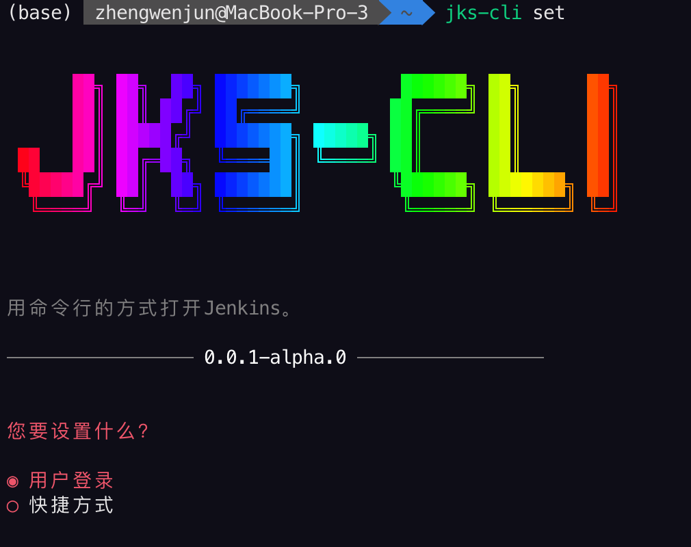
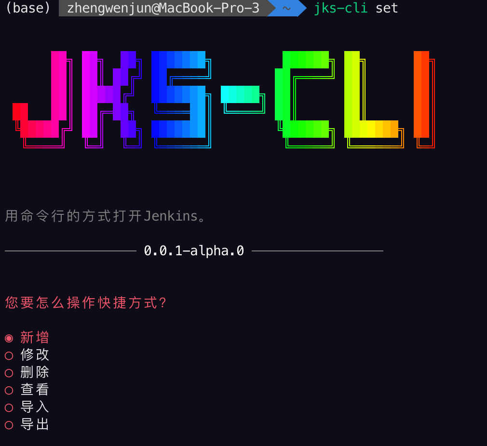
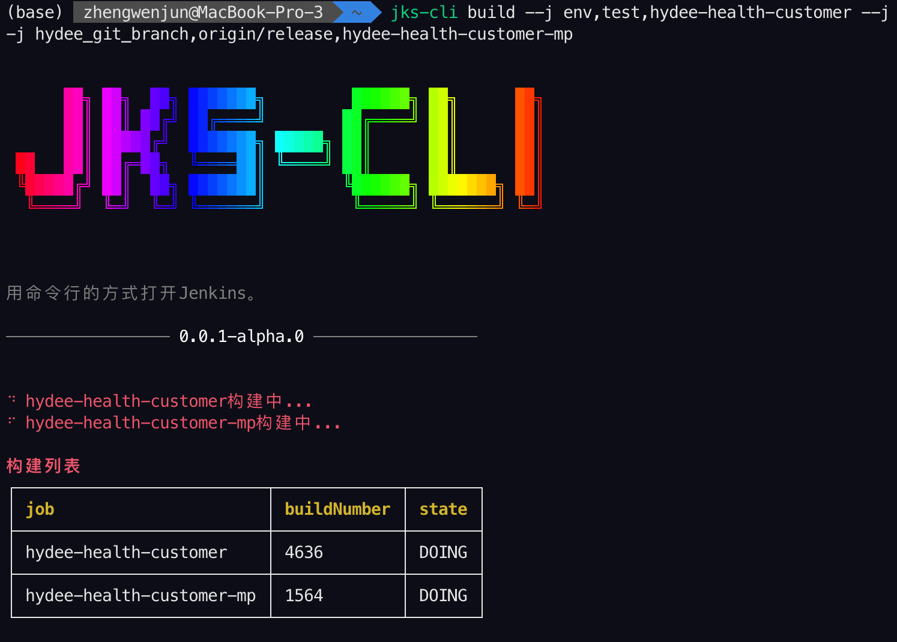
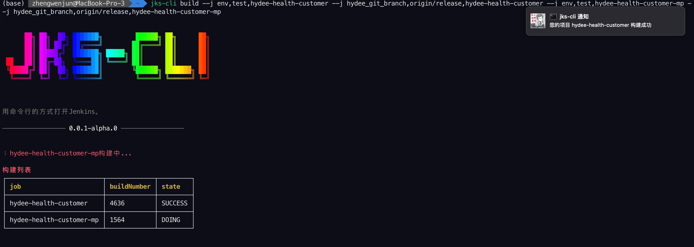

# jks-cli

> 用命令行的方式打开Jenkins。
---------
[](https://npmjs.com/package/jks-cli)

## 安装

```bash
$ npm install --global jks-cli
```

## 快速开始
如果您没有安装[Nodejs](https://nodejs.org/)，请先安装。

```bash
# 帮助文档
$ jks-cli --help

# 设置Jenkins用户信息、快捷方式等
$ jks-cli set

# 构建项目，其中env为参数化构建参数key，test为参数化构建参数value，jenkins-job为jenkins项目名，需要根据实际情况替换。
$ jks-cli build --job env,test,jenkins-job
```

## 高级用法
同时构建多个项目
```bash
# 如果您需要同时构建多个项目
$ jks-cli build --job env,test,jenkins-job-1 --job env,uat,jenkins-job-2
```

不带参数构建
```bash
$ jks-cli build --job ,,jenkins-job
```

多个构建参数
```bash
# 如果您的项目需要多个参数，注意同一项目的不同参数的项目名需要一致
$ jks-cli build --job env,test,jenkins-job-1 --job branch,release,jenkins-job-1 --job env,uat,jenkins-job-2 --job branch,uat,jenkins-job-2
```

自定义分隔符
```bash
# 如果您不想使用“,”进行分割
$ jks-cli build --symbol @ --job env@test@jenkins-job
```

使用快捷方式快速构建
```bash
# 使用交互的方式进行快捷构建
$ jks-cli run
```

指定快捷方式
```bash
# 携带quick参数指定快捷方式，其中quick-title替换成对应的快捷方式标题。
$ jks-cli run --quick quick-title
```

取消构建任务
```bash
# 写在job参数，其中4635为构建队列中的编号buildNumber，jenkins-job为jenkins项目名，根据实际情况替换
$ jks-cli stop --job 4635,jenkins-job
```

取消多个构建任务
```bash
$ jks-cli stop --job 4635,jenkins-job-1 --job 3347,jenkins-job-2
```

## 效果展示
```bash
# 设置您的通知
$ jks-cli set
```



```bash
$ jks-cli build
```




## 常见问题
1. 构建过程中项目状态同步不正确

    > 由于Jenkins API限制，目前是通过查询最近一次构建记录的build_number来同步状态的。在查询build_number时存在一定的延迟导致可能查询到的build_number不是本次构建的任务。


## 功能进展
- [x] 构建项目功能
- [x] 构建完成通知功能
- [x] 快捷方式功能
- [x] 导入导出设置功能
- [ ] Jenkins控制台输出、日志查看等功能
